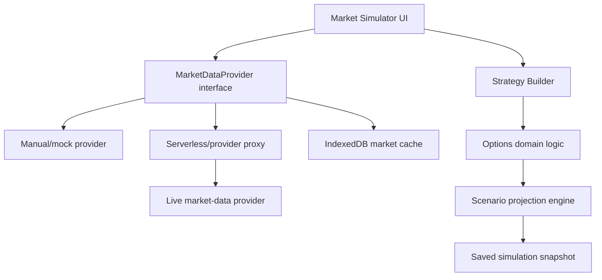
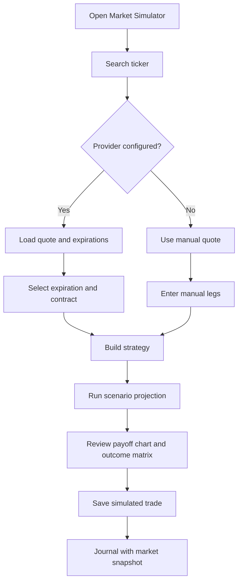

# 17 - Real Market Simulation

## Purpose

Let users search for a real ticker, load stock and options market context, choose strikes and expirations, and project simulated profit/loss outcomes across different prices and days to expiration.

This turns the current builder from a purely manual learning tool into a real-symbol simulator while keeping the product education-only.

## Product Boundary

This feature remains simulation-only.

It must not:

- place live trades
- connect to brokerage execution
- recommend a strategy for the user
- imply personalized investment advice
- hide whether prices are real-time, delayed, cached, or manual
- imply that a historical or modeled result predicts the future

Every market-backed simulation must show:

- data provider
- quote timestamp
- real-time, delayed, cached, or manual status
- last refresh time
- educational disclaimer
- assumptions used in the projection

## Official Data Source Notes

Provider options verified May 3, 2026.

| Provider | Useful endpoints | Strengths | Caveats | MVP fit |
| --- | --- | --- | --- | --- |
| Polygon / Massive | [Options chain snapshot](https://polygon.io/docs/rest/options/snapshots/option-chain-snapshot), [unified snapshot](https://polygon.io/docs/rest/options/snapshots/unified-snapshot), [options overview](https://www.polygon.io/docs/options) | Full U.S. options data, chain snapshots, greeks, implied volatility, open interest, underlying context. | Plan controls real-time vs 15-minute delayed access. Some snapshot endpoints are paid. | Strong if we want rich chain data and greeks. |
| Tradier | [Options chains](https://docs.tradier.com/reference/brokerage-api-markets-get-options-chains), [quotes](https://docs.tradier.com/reference/brokerage-api-markets-get-quotes), [endpoints](https://docs.tradier.com/docs/endpoints) | Straightforward quote and chain APIs, option chain greeks available, sandbox supports delayed market data. | It is also a brokerage API, so we must intentionally avoid account/order endpoints. Requires token/account setup. | Good if we want a broker-style market data flow without execution. |
| MarketData.app | [Option chain](https://www.marketdata.app/docs/api/options/chain/), [stock quotes](https://www.marketdata.app/docs/api/stocks/quotes/), [API overview](https://www.marketdata.app/docs/api/) | Filtering by expiration, DTE, side, strike, spread, volume, open interest, greeks, and historical chain support. AAPL can be tried without auth. | Credits can scale with full chains, especially SPY/SPX/QQQ. Entitlements determine delayed vs real-time options data. | Very good for prototyping because docs are simple and filters are useful. |
| Alpha Vantage | [API documentation](https://www.alphavantage.co/documentation/) | Stock search/quote APIs plus realtime and historical U.S. options APIs; greeks/IV can be requested for options. | Realtime options is premium, and endpoint shape is less chain-browser oriented than MarketData.app. | Good fallback or second adapter. |

Recommended provider strategy:

1. Build a provider adapter interface first.
2. Ship a mock/manual provider first so the UX and math can be reviewed without an API key.
3. Add one live provider behind a feature flag.
4. Keep provider calls behind a backend/proxy for production so API keys are not bundled into the frontend.
5. Cache fetched quotes and chains locally in IndexedDB with visible freshness labels.

## Architecture

Use a layered architecture so market data does not leak into the existing option math code.



### Frontend Modules

- `src/features/market/`: ticker search, quote card, chain browser, outcome matrix.
- `src/services/marketData/`: provider interface, adapters, normalizers, request errors.
- `src/domain/scenarios/`: expiration scenario calculations and optional theoretical mark estimates.
- `src/data/localDatabase.ts`: new stores for market settings, cached quotes, cached chains, and projections.
- `src/features/builder/`: "Use market quote" and "Add from chain" integration.
- `src/features/journal/`: saved market snapshot display.

### Provider Interface

```ts
type MarketDataProviderId =
  | "manual"
  | "mock"
  | "polygon"
  | "tradier"
  | "marketdata_app"
  | "alpha_vantage";

type MarketDataFreshness = "realtime" | "delayed" | "cached" | "manual" | "unknown";

type SymbolSearchResult = {
  symbol: string;
  name?: string;
  exchange?: string;
  assetType?: "stock" | "etf" | "index" | "unknown";
};

type UnderlyingQuote = {
  id: string;
  symbol: string;
  name?: string;
  lastPrice: number;
  bid?: number;
  ask?: number;
  mid?: number;
  previousClose?: number;
  change?: number;
  changePercent?: number;
  provider: MarketDataProviderId;
  dataStatus: MarketDataFreshness;
  fetchedAt: string;
  providerTimestamp?: string;
};

type OptionExpiration = {
  id: string;
  symbol: string;
  expirationDate: string;
  daysToExpiration: number;
  provider: MarketDataProviderId;
  fetchedAt: string;
};

type OptionQuote = {
  id: string;
  symbol: string;
  optionSymbol: string;
  type: "call" | "put";
  strike: number;
  expirationDate: string;
  bid?: number;
  ask?: number;
  mid?: number;
  last?: number;
  volume?: number;
  openInterest?: number;
  impliedVolatility?: number;
  delta?: number;
  gamma?: number;
  theta?: number;
  vega?: number;
  provider: MarketDataProviderId;
  dataStatus: MarketDataFreshness;
  fetchedAt: string;
  providerTimestamp?: string;
};

interface MarketDataProvider {
  id: MarketDataProviderId;
  label: string;
  searchSymbols(query: string): Promise<SymbolSearchResult[]>;
  getQuote(symbol: string): Promise<UnderlyingQuote>;
  getExpirations(symbol: string): Promise<OptionExpiration[]>;
  getOptionChain(symbol: string, expirationDate: string): Promise<OptionQuote[]>;
}
```

## Feature 17.1 - Market Data Settings

### Purpose

Let the user choose market-data mode and configure credentials without making the app depend on any one provider.

### User Stories

- As a learner, I want to use manual mode without signing up for an API.
- As a learner, I want to test a provider connection before using it.
- As a maintainer, I want provider keys isolated from simulation logic.

### UI Requirements

- Provider selector: Manual, Mock, Polygon, Tradier, MarketData.app, Alpha Vantage.
- API key input with show/hide toggle.
- Storage choice: session only, local opt-in, or no storage.
- Test connection button.
- Provider status chip.
- Clear cached market data button.
- Short explanation that browser-stored keys are visible to that browser profile.

### Security Rules

- Do not ship provider keys in source code.
- Do not export API keys in normal backup/export.
- In production, provider requests should go through a backend or serverless proxy.
- If a browser-only prototype stores a key locally, require explicit opt-in.

### Data Model

```ts
type MarketDataSettings = {
  id: "market-data";
  provider: MarketDataProviderId;
  apiKeyStorage: "none" | "session" | "local";
  maskedKeyHint?: string;
  lastConnectionTestAt?: string;
  lastConnectionStatus?: "ok" | "error";
  updatedAt: string;
};
```

### Acceptance Criteria

- App runs in manual-only mode with no key.
- Connection test reports success or an actionable error.
- Clearing cached market data does not delete saved journal snapshots.
- Export/import excludes API keys unless the user explicitly chooses otherwise.

## Feature 17.2 - Ticker Search and Quote Loader

### Purpose

Allow users to type a ticker, select a symbol, and load the underlying price used by simulations.

### User Stories

- As a learner, I want to search `AAPL`, `SPY`, or `MSFT`.
- As a learner, I want to know whether the quote is real-time, delayed, cached, or manual.
- As a learner, I want to enter a manual price when market data fails.

### UX Flow

1. User opens the Market Simulator or Builder market panel.
2. User enters a ticker.
3. App normalizes the input to uppercase.
4. App searches the configured provider or validates symbol shape in manual mode.
5. User selects a symbol.
6. App loads the underlying quote.
7. User can apply the quote to the builder.

### UI Requirements

- Search field with uppercase ticker formatting.
- Search results list with symbol, name, and exchange when available.
- Loading, empty, and invalid-symbol states.
- Quote card with price, bid/ask, change, provider, and timestamp.
- Manual price fallback.
- "Refresh quote" action with rate-limit guard.
- "Use in builder" action.

### Acceptance Criteria

- User can populate builder underlying price from a quote.
- Manual fallback works without an API key.
- Cached quote is clearly labeled as cached.
- Invalid ticker input shows a useful error and does not break the builder.

## Feature 17.3 - Option Chain Browser

### Purpose

Load expirations and strikes for a selected ticker so users can build realistic option legs without typing every value manually.

### User Stories

- As a learner, I want to select an expiration date from a real chain.
- As a learner, I want to choose a strike and call/put type from a table.
- As a learner, I want liquidity context like bid/ask spread, volume, and open interest.

### UX Flow

1. User loads an underlying quote.
2. App requests expirations.
3. User selects expiration or DTE range.
4. App requests the option chain for the selected expiration.
5. User filters calls/puts, strikes near price, liquidity, and bid/ask spread.
6. User selects a row to populate a strategy leg.

### UI Requirements

- Expiration selector with DTE labels.
- Call/put segmented control.
- Strike table centered around current underlying price.
- Columns: strike, bid, ask, mid, last, volume, open interest, IV, delta.
- Liquidity filter: min volume, min open interest, max spread.
- "Use mid price" action.
- Stale-data warning.
- Manual entry remains available.

### Acceptance Criteria

- Builder can populate strike, premium, type, action, expiration, and contract symbol from a selected contract.
- Missing provider fields render as `--`, not zero.
- Mid price is calculated only when bid and ask are valid positive numbers.
- Chain errors do not block manual leg entry.

## Feature 17.4 - Strategy Builder Live Quote Mode

### Purpose

Connect real-symbol context to the current builder without replacing the existing manual learning workflow.

### User Stories

- As a learner, I want to switch between manual and market-loaded pricing.
- As a learner, I want imported premiums to remain editable.
- As a learner, I want to see which values came from market data.

### UI Requirements

- Builder banner showing selected symbol, quote price, provider, and timestamp.
- Imported leg rows with source indicator.
- Editable premium, strike, expiration, and contract count.
- "Detach market data" action that keeps current values but stops refresh linkage.
- "Refresh selected legs" action.
- Warning when refreshed data changes a premium materially.

### State Rules

- Imported values become normal builder inputs after insertion.
- Refresh updates only fields explicitly linked to market data.
- Manual edits mark that field as user-overridden.
- Saving stores the market snapshot and the final user-edited assumptions.

### Acceptance Criteria

- Market-loaded legs can be edited before saving.
- Manual strategies still work exactly as before.
- Refresh never overwrites a user-edited field without confirmation.
- Saved journal entries include the final assumptions, not only provider raw data.

## Feature 17.5 - Scenario Projection Engine

### Purpose

Project possible P/L outcomes across stock prices and time assumptions.

### Modeling Levels

Level 1 MVP:

- Expiration payoff using existing domain logic.
- Price move rows: -20%, -10%, -5%, unchanged, +5%, +10%, +20%.
- P/L dollars.
- Percent of max risk when max risk is defined.
- Breakeven markers.

Level 2:

- Black-Scholes approximation for before-expiration estimates.
- User-adjustable implied volatility.
- Days-to-expiration slider.
- Scenario grid by price move and days remaining.
- Clear label: "estimated mark value, not a quote."

Level 3:

- Volatility shock table.
- Greeks-aware estimates when provider greeks/IV exist.
- Multi-expiration handling for calendars/diagonals.
- Explicit simplified-model warning for advanced spreads.

### Data Model

```ts
type ScenarioProjection = {
  id: string;
  tradeDraftId?: string;
  symbol: string;
  underlyingPrice: number;
  projectedAt: string;
  assumptions: {
    daysToExpiration: number;
    impliedVolatility?: number;
    interestRate?: number;
    dividendYield?: number;
    priceMoves: number[];
    pricingMode: "expiration" | "estimated_mark";
  };
  rows: ScenarioRow[];
};

type ScenarioRow = {
  priceMovePercent: number;
  projectedUnderlyingPrice: number;
  expirationProfitLoss: number;
  estimatedMarkProfitLoss?: number;
  percentOfMaxRisk?: number;
  note?: string;
};
```

### Acceptance Criteria

- Scenario table works for every current builder strategy.
- Expiration P/L matches the existing payoff chart domain logic.
- Before-expiration estimates are clearly labeled as estimates.
- Undefined-risk strategies do not show misleading percent-of-risk values.
- Math functions are covered by unit tests.

## Feature 17.6 - Outcome Matrix UI

### Purpose

Give users a fast visual way to compare outcomes by price movement and days remaining.

### UI Requirements

- Price move columns.
- Days remaining rows.
- Cells show estimated dollar P/L.
- Positive, negative, and breakeven styling.
- Tooltip with assumptions.
- Toggle between:
  - dollars
  - percent of max risk
  - per contract
  - total trade
- Beginner mode: expiration only.
- Advanced mode: estimated mark value.

### Acceptance Criteria

- Matrix renders without horizontal overflow on mobile.
- Large tables scroll inside the panel, not the whole page.
- Colors are not the only signal; cells include signs and numbers.
- Empty or undefined cells explain why a value is unavailable.

## Feature 17.7 - Local Market Data Cache

### Purpose

Reduce repeated API calls, support offline review, and preserve the local-first model.

### Cache Rules

- Quotes expire quickly, default 2 to 5 minutes.
- Option chains expire quickly, default 5 to 15 minutes.
- Historical saved simulations keep the quote snapshot used at entry.
- Cache status is visible to the user.
- Full chains should be cached by symbol, expiration, provider, and fetched timestamp.
- Large chains should not be stored forever.

### IndexedDB Stores

```ts
marketDataSettings: "id"
symbolSearchHistory: "id, symbol, searchedAt"
marketQuotes: "id, symbol, provider, fetchedAt"
optionExpirations: "id, symbol, expirationDate, provider, fetchedAt"
optionQuotes: "id, symbol, optionSymbol, expirationDate, strike, type, provider, fetchedAt"
scenarioProjections: "id, symbol, projectedAt"
```

### Acceptance Criteria

- Cache prevents repeated quote calls during normal navigation.
- Refresh bypasses cache only when the user asks or the cache is expired.
- Stale cached data is never shown as current.
- Cache cleanup can remove old market data without breaking saved trades.

## Feature 17.8 - Saved Simulation Snapshot

### Purpose

When a simulated trade is saved, preserve the market context and assumptions used at that time.

### Add To Simulated Trade

```ts
type SimulatedTradeMarketSnapshot = {
  quote?: UnderlyingQuote;
  optionQuotes?: OptionQuote[];
  scenarioProjection?: ScenarioProjection;
  provider?: MarketDataProviderId;
  providerTermsAcknowledgedAt?: string;
};
```

### Journal UI Requirements

- Entry quote timestamp.
- Provider/freshness label.
- Saved price vs current loaded price comparison when current data is available.
- Saved assumptions block.
- Projection table attached to the saved trade.

### Acceptance Criteria

- Saved trade detail shows entry quote timestamp.
- Journal can compare current loaded quote with saved entry snapshot.
- Export/import includes market snapshots.
- Export/import excludes provider API keys by default.

## Feature 17.9 - Market Simulator Workspace

### Purpose

Add a focused workspace for ticker-backed simulation without crowding beginner lessons.

### Route Options

Recommended route: `/market`.

Secondary entry points:

- Dashboard card: "Simulate real ticker."
- Builder side panel: "Load ticker."
- Strategy detail action: "Try with ticker."

### Layout

Desktop:

- Left rail: ticker search, quote card, expiration selector.
- Main: chain browser or selected strategy builder.
- Right rail: outcome summary, breakevens, max profit/loss, data freshness.

Mobile:

- Step tabs:
  1. Ticker
  2. Strategy
  3. Outcomes
  4. Save

### Acceptance Criteria

- User can complete the flow without visiting multiple unrelated pages.
- Layout does not overlap at wide or narrow breakpoints.
- The screen keeps educational labels visible but does not read like a brokerage order ticket.

## UX Flow



## Calculation Rules

- Use expiration payoff as the authoritative MVP calculation.
- Derive mid as `(bid + ask) / 2` only when bid and ask are valid.
- Use `last` only as a fallback display value, not automatically as the simulated entry unless the user chooses it.
- DTE must be calculated from exact dates, not rounded labels.
- Contract multiplier defaults to 100 but remains explicit in calculations.
- Max risk can be omitted for undefined-risk structures.
- Before-expiration theoretical estimates must be visually separated from market quotes.

## Implementation Phases

### Phase 1 - Manual and Mock Foundation

- Add provider types and normalizers.
- Add IndexedDB stores.
- Add market-data settings UI.
- Add ticker search field.
- Add manual quote fallback.
- Add mock provider with deterministic sample symbols.
- Add expiration P/L scenario table using existing payoff logic.

### Phase 2 - Market Simulator Workspace

- Add `/market` route.
- Add quote card.
- Add selected symbol state.
- Add strategy builder integration.
- Add basic outcome summary and scenario table.

### Phase 3 - Option Chain Browser

- Add expiration selector.
- Add option chain table.
- Add filters for strike range, side, volume, open interest, and spread.
- Add "Add leg from chain" flow.
- Cache responses by symbol, provider, and expiration.

### Phase 4 - First Live Provider

- Choose provider.
- Add provider adapter.
- Add provider settings test.
- Add error states and rate-limit messages.
- Add production proxy plan if moving beyond local prototype.

### Phase 5 - Saved Snapshots and Journal Compare

- Store quote and option quote snapshots with saved trades.
- Add snapshot display in journal detail.
- Add current-vs-entry comparison when current quote is loaded.
- Update export/import schema.

### Phase 6 - Advanced Estimation

- Add Black-Scholes estimate module.
- Add IV and days-to-expiration scenario grid.
- Add volatility shock controls.
- Add warnings for simplified model assumptions.

## Open Product Decisions

- Which provider should be the first live adapter?
- Is delayed data acceptable for the first version?
- Should API keys be session-only for MVP or locally stored with opt-in?
- Should we support U.S. stocks and ETFs only at first?
- Should `/market` be a new route immediately, or should ticker loading start inside `/builder`?
- Should beginners see only expiration outcomes while advanced users unlock estimated mark values?
- Should saved simulations preserve all option quote fields or only the fields used by the model?

## Recommended First Build Slice

Build this first:

1. Manual/mock provider.
2. `/market` route with ticker search and quote card.
3. Builder integration for selected ticker and underlying price.
4. Expiration-only scenario table using existing payoff logic.
5. Saved market snapshot on simulated trade save.

Then choose the first live provider. MarketData.app is the simplest prototype candidate because its option-chain filters map directly to the UI we want. Polygon is the strongest richer-data candidate if we want broad chain snapshots, greeks, and underlying context. Tradier is viable but should be handled carefully because it also exposes brokerage/execution APIs.

## Definition of Done

- User can load or manually enter a stock price for a ticker.
- User can model strategies against that symbol.
- User can choose strikes and expirations manually or from provider chain data.
- User can project P/L across price moves.
- User can inspect max profit/loss, breakeven, DTE, and assumptions.
- Saved simulations include quote, option quote, and projection snapshots where available.
- Market data is clearly labeled by provider, timestamp, and freshness.
- The feature remains educational, simulated, and non-advisory.
